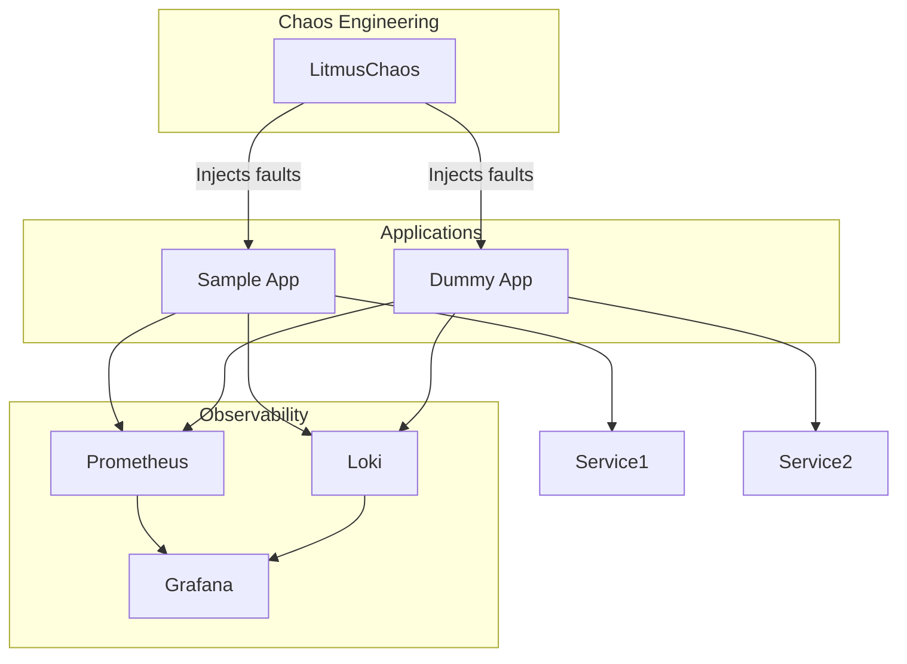

# ☣️ Chaos Engineering Lab with Kubernetes

This lab demonstrates how to implement Chaos Engineering in Kubernetes using **LitmusChaos**, and how to observe the effects using **Prometheus**, **Grafana**, and **Loki**.

It's designed to help SREs and Platform Engineers test infrastructure resilience, visualize fault impact, and validate system recovery under failure conditions.

---

## 🔧 Tech Stack

- Kubernetes (KinD, EKS, GKE, or local)
- [LitmusChaos](https://litmuschaos.io)
- [Prometheus](https://prometheus.io)
- [Grafana](https://grafana.com)
- [Loki](https://grafana.com/oss/loki/)
- [Helm](https://helm.sh)
- [Terraform](https://terraform.io)
- [ArgoCD](https://argoproj.github.io/cd)

---

## 🛠️ Provisioning & Deployment Flow

This project follows a **GitOps-based infrastructure model**, where:

- **Terraform** is used to provision the Kubernetes cluster, ArgoCD, and base dependencies.
- **ArgoCD** takes over to deploy and manage applications declaratively from Git.

Deployment steps:

1. Terraform installs ArgoCD via Helm.
2. ArgoCD syncs:
   - Monitoring stack (Prometheus, Grafana, Loki)
   - Chaos Engineering stack (LitmusChaos)
   - Sample application
   - Chaos experiments

This separation of concerns ensures the infrastructure is reproducible, declarative, and scalable.

## 🧱 Logical Architecture (Chaos + Observability Stack)



---

## 🎯 Why This Project?

This lab is designed to simulate real-world SRE workflows such as:

- Testing application and node resilience via chaos scenarios
- Validating observability tooling (logs, metrics, dashboards)
- Demonstrating GitOps and Infrastructure-as-Code practices
- Practicing safe failure injection and recovery validation

## 📦 Project Structure

```bash
terraform/
├── modules/
│   ├── eks/
│   │   ├── main.tf
│   │   └── variables.tf
│   ├── helm_apps/
│   │   ├── main.tf
│   │   └── variables.tf
│   └── vpc/
├── argocd-values.yaml
├── main.tf
├── outputs.tf
├── variables.tf
├── LICENSE
├── README.md
├── architecture.mmd
```

---

## ⚙️ Requirements

* AWS CLI configured with necessary permissions (`eks:*`, `iam:PassRole`, `ec2:*`, etc.)
* Terraform >= 1.0
* kubectl
* Helm
* ArgoCD CLI (optional, but helpful)

---

## ⚡ Usage

1. **Initialize and apply Terraform:**

   ```bash
   cd terraform
   terraform init
   terraform apply
   ```

2. **Update kubeconfig:**

   ```bash
   aws eks update-kubeconfig --name chaos-lab --region <your-region>
   ```

3. **Access ArgoCD UI:**

   * Port-forward:

     ```bash
     kubectl port-forward svc/argocd-server -n argocd 8080:443
     ```
   * Open: [https://localhost:8080](https://localhost:8080)
   * Default credentials:

     * Username: `admin`
     * Password: Run:

       ```bash
       kubectl get secret argocd-initial-admin-secret -n argocd -o jsonpath="{.data.password}" | base64 -d && echo
       ```

---

## 🔎 Observability Stack

* **Grafana**

  * Port-forward:

    ```bash
    kubectl port-forward svc/kube-prometheus-stack-grafana -n monitoring 3000:80
    ```
  * Open: [http://localhost:3000](http://localhost:3000)
  * Default login:

    * Username: `admin`
    * Password: `prom-operator`

* **Prometheus**

  * Port-forward:

    ```bash
    kubectl port-forward svc/kube-prometheus-stack-prometheus -n monitoring 9090
    ```
  * Open: [http://localhost:9090](http://localhost:9090)

* **Loki** (for logs via Grafana)

  * Already integrated into Grafana as a data source

---

## 🚀 Chaos Engineering with Litmus

1. **Litmus Portal Access**

   * Port-forward:

     ```bash
     kubectl port-forward svc/litmusportal-frontend-service -n litmus 9091:9091
     ```
   * Open: [http://localhost:9091](http://localhost:9091)

2. **Run a Chaos Experiment**

   * Go to `Litmus Portal`
   * Log in (admin credentials are printed at deploy time)
   * Create a Chaos Workflow
   * Select pre-defined experiments like:

     * Pod delete
     * CPU hog
     * Network latency
   * Execute and observe via Grafana dashboards

---

## 📈 Tips

* Monitor experiment results in both **Litmus UI** and **Grafana**.
* Ensure the test applications are running for chaos to have impact.
* You can customize experiments via YAMLs if preferred over the UI.

---

## ✅ Done!

You now have a complete Chaos Engineering playground running in EKS.
