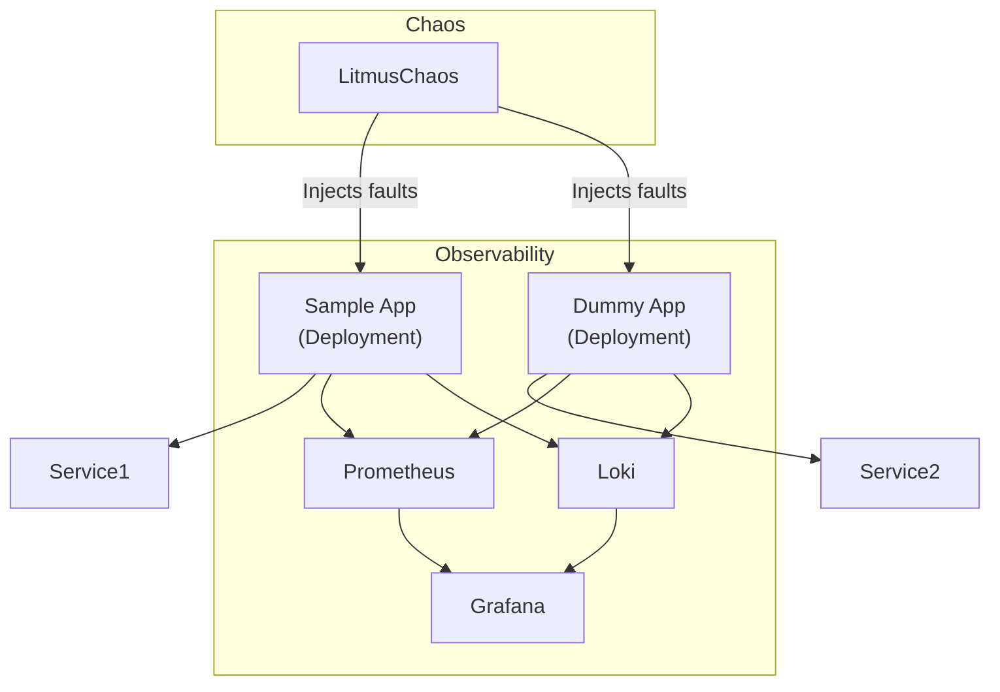

# ☣️ Chaos Engineering Lab with Kubernetes

This lab demonstrates how to implement Chaos Engineering in Kubernetes using **LitmusChaos**, and how to observe the effects using **Prometheus**, **Grafana**, and **Loki**.

It's designed to help SREs and Platform Engineers test infrastructure resilience, visualize fault impact, and validate system recovery under failure conditions.

---

## 🔧 Tech Stack

- Kubernetes (KinD, EKS, GKE, or local)
- [LitmusChaos](https://litmuschaos.io)
- [Prometheus](https://prometheus.io)
- [Grafana](https://grafana.com)
- [Loki](https://grafana.com/oss/loki/)
- [Helm](https://helm.sh)
- [Terraform](https://terraform.io)
- [ArgoCD](https://argoproj.github.io/cd)

---

## 🛠️ Provisioning & Deployment Flow

This project follows a **GitOps-based infrastructure model**, where:

- **Terraform** is used to provision the Kubernetes cluster, ArgoCD, and base dependencies.
- **ArgoCD** takes over to deploy and manage applications declaratively from Git.

Deployment steps:

1. Terraform installs ArgoCD via Helm.
2. ArgoCD syncs:
   - Monitoring stack (Prometheus, Grafana, Loki)
   - Chaos Engineering stack (LitmusChaos)
   - Sample application
   - Chaos experiments

This separation of concerns ensures the infrastructure is reproducible, declarative, and scalable.

## 🧱 Logical Architecture (Chaos + Observability Stack)

---

## 🎯 Why This Project?

This lab is designed to simulate real-world SRE workflows such as:

- Testing application and node resilience via chaos scenarios
- Validating observability tooling (logs, metrics, dashboards)
- Demonstrating GitOps and Infrastructure-as-Code practices
- Practicing safe failure injection and recovery validation
